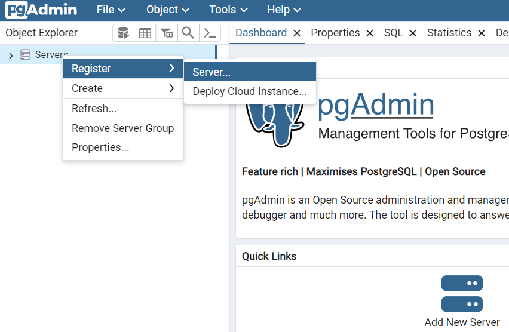

# Relatório Analítico usando SQL - Northwind database

Este projeto tem como objetivo gerar um relatório analítico de negócios a partir de um banco de dados de vendas.

O banco de dados Northwind contém dados de vendas de uma empresa chamada Northwind Traders, que importa e exporta alimentos especiais de todo o mundo. Neste relatório, vamos nos concentrar principalmente em extrair insights de dados de receita, produto e cliente usando operações SQL em um banco de dados PostgreSQL.

As análises apresentadas aqui podem beneficiar empresas de todos os tamanhos que buscam aprimorar suas capacidades analíticas. Através desses relatórios, as organizações podem se posicionar estrategicamente no mercado, aproveitando decisões orientadas por dados para melhorar seus resultados futuros.

É possível executar este projeto usando apenas Docker, pois ele constrói tanto o banco de dados PostgreSQL quanto o cliente pgAdmin. As instruções são fornecidas na sessão [Como Rodar Este Projeto](#Como-Rodar-Este-Projeto).

## Lista de Conteúdos
- [Questões a serem respondidas](#questoes-a-serem-respondidas)
    - [Receita Operacional de Vendas](#receita-operacional-de-vendas)
        - [Como visualizar a receita operacional ao longo dos anos?](#como-visualizar-a-receita-operacional-ao-longo-dos-anos)
        - [Como visualizar as tendências de receita operacional para cada ano?](#como-visiualizar-as-tendencias-de-receita-operacional-para-cada-ano)
    - [Análise de CLientes](#analise-de-clientes)
        - [Quais os clientes responsaveis pela maior parte da receita?](#quais-os-clientes-responsaveis-pela-maior-parte-da-receita)
        - [Como classificar os clientes para abordagens diferenciadas?](#como-classificar-os-clientes-para-abordagens-diferenciadas)
    - [Análise de Produtos](#analise-de-produto)
        - [Quais produtos possuem maior faturamento?](#quais-produtos-tem-maior-receita)
    - [Conclusao](#conlusao)

- [Database](#database)
- [Como Rodar Este Projeto](#Como-Rodar-Este-Projeto)

-------------------------------

## Questoes a serem respondidas

### Relatorio Operacional de Vendas

#### Como visualizar a receita operacional ao longo dos anos?

A consulta abaixo agrega a receita operacional por ano e calcula a receita operacional acumulada ao longo dos mesmos anos. É útil para obter uma tendência geral dos resultados.
```sql
CREATE VIEW annual_revenues_analysis AS
WITH annual_revenues AS (
    SELECT 
        EXTRACT(YEAR FROM o.order_date) AS year,
        ROUND(SUM((od.unit_price * od.quantity) * (1 - od.discount))::numeric, 2) as revenue
    FROM 
        order_details AS od
    LEFT JOIN 
        orders AS o 
        ON od.order_id = o.order_id
    GROUP BY 
        EXTRACT(YEAR FROM o.order_date)
)
SELECT 
    year,
    revenue,
    SUM(revenue) OVER (ORDER BY year) AS cumulative_revenue
FROM annual_revenues;
```

| year | revenue | cumulative_revenue |
|------|---------------|--------------------------|
| 1996 | 208083.97     | 208083.97                |
| 1997 | 617085.20     | 825169.17                |
| 1998 | 440623.87     | 1265793.04               |

#### Como visualizar as tendências de receita operacional para cada ano?

Usando uma abordagem semelhante à da consulta anterior, podemos agregar a receita operacional por mês, calcular a receita operacional acumulada por ano (ano até a data) e obter a diferença total e relativa entre cada mês. Isso pode ser útil para observar tendências em pequenas janelas de tempo e identificar padrões específicos do negócio, como determinadas partes do ano que geram melhores resultados do que outras.

```sql
CREATE VIEW ytd_revenue_analysis AS
WITH monthly_revenue_table AS (
    SELECT
        EXTRACT(YEAR FROM o.order_date) AS year,
        EXTRACT(MONTH FROM o.order_date) AS month,
        ROUND(SUM(od.unit_price * od.quantity * (1.0 - od.discount))::numeric,2) AS monthly_revenue
    FROM 
        order_details AS od
    LEFT JOIN 
        orders AS o 
        ON od.order_id = o.order_id
    GROUP BY
        EXTRACT(YEAR FROM o.order_date),
        EXTRACT(MONTH FROM o.order_date)
),
cumulative_revenue_table AS (
    SELECT
        year,
        month,
        monthly_revenue,
        SUM(monthly_revenue) OVER (PARTITION BY year ORDER BY month) AS ytd_revenue
    FROM 
        monthly_revenue_table
)
SELECT
    year,
    month,
    monthly_revenue,
	ytd_revenue,
    monthly_revenue - LAG(monthly_revenue) OVER (PARTITION BY year ORDER BY month) AS monthly_difference,
    ROUND((monthly_revenue - LAG(monthly_revenue) OVER (PARTITION BY year ORDER BY month)) / LAG(monthly_revenue) OVER (PARTITION BY year ORDER BY month) * 100::numeric,2) AS percentage_monthly_difference
FROM 
    cumulative_revenue_table
ORDER BY 
    year, month;
```

| year | month | monthly_revenue | ytd_revenue | monthly_difference | percentage_monthly_difference |
|------|-------|---------|--------------------|----------------|--------------------|
| 1996 | 7     | 27861.90 | 27861.90           |                |                    |
| 1996 | 8     | 25485.28 | 53347.18           | -2376.62       | -8.53              |
| 1996 | 9     | 26381.40 | 79728.58           | 896.12         | 3.52               |
| ... | ...     | ... | ...        | ...          | ...               |
| 1998 | 3     | 104854.16| 298491.56          | 5438.87        | 5.47               |
| 1998 | 4     | 123798.68| 422290.24          | 18944.52       | 18.07              |
| 1998 | 5     | 18333.63 | 440623.87          | -105465.05     | -85.19             |


### Analise de CLientes

#### Quais os clientes responsaveis pela maior parte da receita?

A consulta abaixo ordena os clientes pela receita operacional total e relativa pela qual eles foram responsáveis ao longo do tempo total. Isso é muito útil para entender a concentração da receita operacional e prever resultados futuros.

```sql
CREATE VIEW customers_analysis AS
SELECT
    c.company_name,
    ROUND(SUM((od.unit_price * od.quantity) * (1 - od.discount))::numeric, 2) AS total_revenue,
    ROUND((SUM((od.unit_price * od.quantity) * (1 - od.discount)) / SUM(SUM((od.unit_price * od.quantity) * (1 - od.discount))) OVER() * 100)::numeric, 2) AS percentage_of_total_revenue
FROM 
    order_details AS od
LEFT JOIN 
    orders AS o 
    ON od.order_id = o.order_id
LEFT JOIN 
    customers AS c 
    ON c.customer_id = o.customer_id
GROUP BY 
    c.company_name
ORDER BY 
    total_revenue DESC
```

| company_name                       | total_revenue | percentage_of_total_revenue |
|--------------------------------|---------------|------------|
| QUICK-Stop                      | 110277.31     | 8.71       |
| Ernst Handel                   | 104874.98     | 8.29       |
| Save-a-lot Markets              | 104361.95     | 8.24       |
| Rattlesnake Canyon Grocery      | 51097.80      | 4.04       |
| ...                              | ...           | ...        |
| Lazy K Kountry Store            | 357.00        | 0.03       |
| Centro comercial Moctezuma      | 100.80        | 0.01       |


#### Como classificar os clientes para abordagens diferenciadas?

Depois de classificar os clientes com base na receita operacional, podemos categorizá-los executando a seguinte consulta.

```sql
CREATE VIEW revenue_groups AS 
SELECT
    c.company_name,
    ROUND(SUM((od.unit_price * od.quantity) * (1 - od.discount))::numeric, 2) AS total_revenue,
    ROUND((SUM((od.unit_price * od.quantity) * (1 - od.discount)) / SUM(SUM((od.unit_price * od.quantity) * (1 - od.discount))) OVER() * 100)::numeric, 2) AS percentage_of_total_revenue,
    NTILE(5) OVER (ORDER BY SUM((od.unit_price * od.quantity) * (1 - od.discount)) DESC) AS revenue_group
FROM 
    order_details AS od
LEFT JOIN 
    orders AS o 
    ON od.order_id = o.order_id
LEFT JOIN 
    customers AS c 
    ON c.customer_id = o.customer_id
GROUP BY 
    c.company_name
ORDER BY 
    total_revenue DESC
```

| company_name                       | total_revenue | percentage_of_total_revenue | revenue_group |
|-------------------------------|---------------|-----------------------------|---------------|
| QUICK-Stop                    | 110277.31     | 8.71                        | 1             |
| Ernst Handel                 | 104874.98     | 8.29                        | 1             |
| ...                           | ...           | ...                         | ...           |
| Lazy K Kountry Store         | 357.00        | 0.03                        | 5             |
| Centro comercial Moctezuma   | 100.80        | 0.01                        | 5             |


Agora, apenas os clientes que estão nos grupos 3, 4 e 5 serão selecionados para uma análise de marketing especial com eles, por exemplo.

```sql
CREATE VIEW revenue_groups_filtered AS
WITH companies_revenue_groups AS (
    SELECT
        c.company_name,
        ROUND(SUM((od.unit_price * od.quantity) * (1 - od.discount))::numeric, 2) AS total_revenue,
        ROUND((SUM((od.unit_price * od.quantity) * (1 - od.discount)) / SUM(SUM((od.unit_price * od.quantity) * (1 - od.discount))) OVER() * 100)::numeric, 2) AS percentage_of_total_revenue,
        NTILE(5) OVER (ORDER BY SUM((od.unit_price * od.quantity) * (1 - od.discount)) DESC) AS revenue_group
    FROM 
        order_details AS od
    LEFT JOIN 
        orders AS o 
        ON od.order_id = o.order_id
    LEFT JOIN 
        customers AS c 
        ON c.customer_id = o.customer_id
    GROUP BY 
        c.company_name
    ORDER BY 
        total_revenue DESC
)
SELECT 
    *   
FROM 
    companies_revenue_groups
WHERE 
    revenue_group IN (3,4,5);
```

| company_name                       | total_revenue | percentage_of_total_revenue | revenue_group |
|------------------------------------|---------------|-----------------------------|---------------|
| Split Rail Beer & Ale              | 11441.63      | 0.90                        | 3             |
| Tortuga Restaurante                | 10812.15      | 0.85                        | 3             |
| ...                                | ...           | ...                         | ...           |
| Lazy K Kountry Store               | 357.00        | 0.03                        | 5             |
| Centro comercial Moctezuma         | 100.80        | 0.01                        | 5             |


Também podemos filtrar os clientes por critérios específicos, como filtrar apenas os clientes do Reino Unido que pagaram mais de 1000 dólares, por exemplo.

```sql
CREATE VIEW uk_customers_who_payed_more_than_1000 AS 
SELECT 
    c.company_name, 
    ROUND(SUM(od.unit_price * od.quantity * (1.0 - od.discount))::numeric, 2) AS revenue
FROM 
    order_details AS od
LEFT JOIN 
    orders AS o 
    ON od.order_id = o.order_id
LEFT JOIN 
    customers AS c
    ON o.customer_id = c.customer_id
WHERE 
    LOWER(c.country) = 'uk'
GROUP BY 
    c.company_name
HAVING 
    SUM(od.unit_price * od.quantity * (1.0 - od.discount)) > 1000
ORDER BY
    revenue DESC;
```

| company_name           | revenue |
|-------------------------|---------------|
| Seven Seas Imports      | 16215.33      |
| Eastern Connection      | 14761.03      |
| Around the Horn         | 13390.65      |
| Island Trading          | 6146.30       |
| B's Beverages           | 6089.90       |
| Consolidated Holdings   | 1719.10       |


### Analise de Produtos

#### Quais produtos possuem maior faturamento?

A consulta abaixo ordena os produtos responsáveis por gerar mais receita operacional, assim como a quantidade total vendida.

```sql
CREATE VIEW products_analysis AS
SELECT 
    DISTINCT p.product_name, 
    ROUND((SUM(od.unit_price * od.quantity * (1.0 - od.discount)) OVER (PARTITION BY p.product_name))::numeric, 2) AS revenue,
    SUM(od.quantity) OVER (PARTITION BY p.product_name) AS quantity_sold
FROM 
    order_details AS od
LEFT JOIN 
    products AS p
    ON od.product_id = p.product_id
ORDER BY 
    revenue DESC;
```

| product_name                       | revenue   | quantity_sold |
|------------------------------------|-----------|---------------|
| Côte de Blaye                     | 141396.74 | 623           |
| Thüringer Rostbratwurst           | 80368.67  | 746           |
| Raclette Courdavault              | 71155.70  | 1496          |
|...|...|...|
| Genen Shouyu                      | 1784.82   | 122           |
| Geitost                           | 1648.12   | 755           |
| Chocolade                         | 1368.71   | 138           |

### Conlusao

Neste relatório, realizamos algumas consultas para obter insights específicos de negócios para auxiliar a empresa. Sempre existem mais filtros e abordagens que podemos explorar, assim como expandir a análise mensal da receita operacional para incluir clientes e produtos.

## Database

O banco de dados Northwind contém dados de vendas de uma empresa chamada Northwind Traders, que importa e exporta alimentos especiais de todo o mundo.

O banco de dados Northwind é um ERP com dados sobre clientes, pedidos, inventário, compras, fornecedores, remessas, funcionários e contabilidade.

O conjunto de dados Northwind inclui dados de exemplo para os seguintes itens:

* **Suppliers**: fornecedores e vendedores da Northwind
* **Customers**: clientes que compraram produtos da Northwind
* **Employees**: Detalhes sobre os vendedores da Northwind
* **Products**: Informações dos produtos
* **Shippers**: Informações sobre os transportadores
* **Orders** e **Order Details**: Transações de vendas e ordens de compra dos clientes para a Northwind

O banco de dados Northwind inclui 14 tabelas, e os relacionamentos entre as tabelas são mostrados no diagrama de relacionamento de entidades a seguir.


## Como rodar este projeto

### Manualmente

After connecting to your own database, use the [`northwind.sql`](northwind.sql) file to populate the database by copying the script, pasting it into the query tool, and running it.

### With Docker

É necessário ter o Docker e o Docker Compose instalados para poder executar este projeto.

- [Start with Docker](https://www.docker.com/get-started/)
- [Install Docker Compose](https://docs.docker.com/compose/install/)

Tendo o Docker instalado, siga os seguintes passos:

1. Clone o repositorio localmente.
```bash 
git clone https://github.com/lealre/northwind-analytics-sql.git
```

2. Acesse a pasta do projeto.
```bash
cd northwind-analytics-sql
```

3. Crie o Docker container.
```bash
docker compose up -d
```

O `-d` flag é usado para executar o contêiner em segundo plano, desconectado do terminal.

4. Acesse o pgAdmin em http://localhost:5050/

5. Configure o master password (utilizado quando acessar pela primeira vez apenas).


6. Clique com o botão direito para conectar o pgAdmin com o database.




7. Defina um nome para o servidor (a sua escolha).


8. Conecte com a base de dados conforme as credencias setadas no [`docker-compose.yaml`](docker-compose.yaml) file.

`Host name`: `db`

`Password`: `postgres`


Após completar este último passo, será possível acessas a base de dado e visualizar os schemas utilizado nos relatórios.
