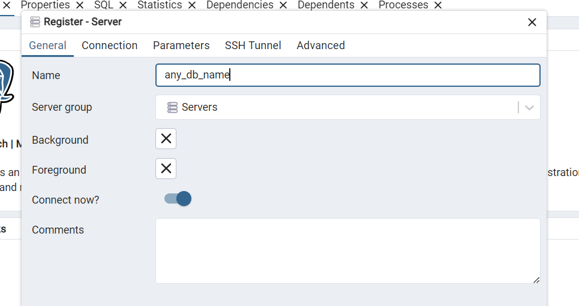
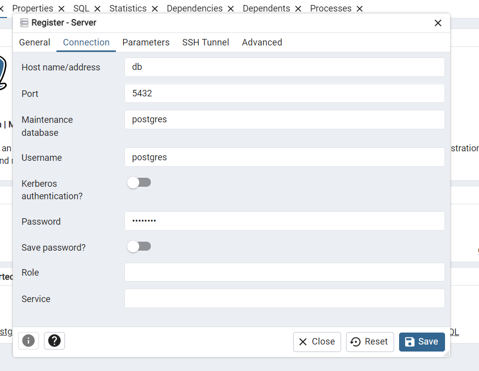

# Relatório Analítico usando SQL - Northwind database

Este projeto tem como objetivo gerar um relatório analítico de negócios a partir de um banco de dados de vendas.

O banco de dados Northwind contém dados de vendas de uma empresa chamada Northwind Traders, que importa e exporta alimentos especiais de todo o mundo. Neste relatório, vamos nos concentrar principalmente em extrair insights de dados de receita, produto e cliente usando operações SQL em um banco de dados PostgreSQL.

As análises apresentadas aqui podem beneficiar empresas de todos os tamanhos que buscam aprimorar suas capacidades analíticas. Através desses relatórios, as organizações podem se posicionar estrategicamente no mercado, aproveitando decisões orientadas por dados para melhorar seus resultados futuros.

É possível executar este projeto usando apenas Docker, pois ele constrói tanto o banco de dados PostgreSQL quanto o cliente pgAdmin. As instruções são fornecidas na sessão [Como Rodar Este Projeto](#Como-Rodar-Este-Projeto).

## Lista de Conteúdos
- [Questões a serem respondidas](#questoes-a-serem-respondidas)
    - [Relatório Operacional de Vendas](#relatorio-operacional-de-vendas)
        - [Como visualizar as vendas ao longo dos anos?](#como-visualizar-as-vendas-ao-longo-dos-anos)
        - [Como visualizar as tendências de venda para cada ano?](#como-visiualizar-as-tendencias-de-venda-para-cada-ano)
    - [Análise de CLientes](#analise-de-clientes)
        - [Quais os clientes responsaveis pela maior parte da receita?](#quais-os-clientes-responsaveis-pela-maior-parte-da-receita)
        - [Como classificar os clientes para abordagens diferenciadas?](#como-classificar-os-clientes-para-abordagens-diferenciadas)
    - [Análise de Produtos](#analise-de-produto)
        - [Quais produtos possuem maior faturamento?](#quais-produtos-tem-maior-receita)
    - [Conclusion](#conlusion)

- [Database](#database)
- [Como Rodar Este Projeto](#Como-Rodar-Este-Projeto)

-------------------------------

## Questions we want to answer

### Operational Revenue

#### How can we observe the operational revenue over the years?

The query below aggregates the operational revenue by year and calculates the cumulative operational revenue over the same years. It is useful for obtaining an overall trend of the results.

```sql
CREATE VIEW annual_revenues_analysis AS
WITH annual_revenues AS (
    SELECT 
        EXTRACT(YEAR FROM o.order_date) AS year,
        ROUND(SUM((od.unit_price * od.quantity) * (1 - od.discount))::numeric, 2) as revenue
    FROM 
        order_details AS od
    LEFT JOIN 
        orders AS o 
        ON od.order_id = o.order_id
    GROUP BY 
        EXTRACT(YEAR FROM o.order_date)
)
SELECT 
    year,
    revenue,
    SUM(revenue) OVER (ORDER BY year) AS cumulative_revenue
FROM annual_revenues;
```

| year | revenue | cumulative_revenue |
|------|---------------|--------------------------|
| 1996 | 208083.97     | 208083.97                |
| 1997 | 617085.20     | 825169.17                |
| 1998 | 440623.87     | 1265793.04               |

#### How can we observe the trends of the operational revenue within each year?

By using a similar approach to the previous query, we can aggregate the operational revenue by month, calculate the cumulative operational revenue by year (year-to-date), and obtain the total and relative difference between each month. This can be useful for observing trends in small time windows and identifying patterns specific to the business, such as certain parts of the year yielding better results than others.

```sql
CREATE VIEW ytd_revenue_analysis AS
WITH monthly_revenue_table AS (
    SELECT
        EXTRACT(YEAR FROM o.order_date) AS year,
        EXTRACT(MONTH FROM o.order_date) AS month,
        ROUND(SUM(od.unit_price * od.quantity * (1.0 - od.discount))::numeric,2) AS monthly_revenue
    FROM 
        order_details AS od
    LEFT JOIN 
        orders AS o 
        ON od.order_id = o.order_id
    GROUP BY
        EXTRACT(YEAR FROM o.order_date),
        EXTRACT(MONTH FROM o.order_date)
),
cumulative_revenue_table AS (
    SELECT
        year,
        month,
        monthly_revenue,
        SUM(monthly_revenue) OVER (PARTITION BY year ORDER BY month) AS ytd_revenue
    FROM 
        monthly_revenue_table
)
SELECT
    year,
    month,
    monthly_revenue,
	ytd_revenue,
    monthly_revenue - LAG(monthly_revenue) OVER (PARTITION BY year ORDER BY month) AS monthly_difference,
    ROUND((monthly_revenue - LAG(monthly_revenue) OVER (PARTITION BY year ORDER BY month)) / LAG(monthly_revenue) OVER (PARTITION BY year ORDER BY month) * 100::numeric,2) AS percentage_monthly_difference
FROM 
    cumulative_revenue_table
ORDER BY 
    year, month;
```

| year | month | monthly_revenue | ytd_revenue | monthly_difference | percentage_monthly_difference |
|------|-------|---------|--------------------|----------------|--------------------|
| 1996 | 7     | 27861.90 | 27861.90           |                |                    |
| 1996 | 8     | 25485.28 | 53347.18           | -2376.62       | -8.53              |
| 1996 | 9     | 26381.40 | 79728.58           | 896.12         | 3.52               |
| ... | ...     | ... | ...        | ...          | ...               |
| 1998 | 3     | 104854.16| 298491.56          | 5438.87        | 5.47               |
| 1998 | 4     | 123798.68| 422290.24          | 18944.52       | 18.07              |
| 1998 | 5     | 18333.63 | 440623.87          | -105465.05     | -85.19             |


### Customers Analysis

#### From which customers do we have the main operational revenue?

The query below orders the customers by the total and relative operational revenue they were responsible for over the total time. This is very useful for understanding the concentration of operational revenue and forecasting future results. 

```sql
CREATE VIEW customers_analysis AS
SELECT
    c.company_name,
    ROUND(SUM((od.unit_price * od.quantity) * (1 - od.discount))::numeric, 2) AS total_revenue,
    ROUND((SUM((od.unit_price * od.quantity) * (1 - od.discount)) / SUM(SUM((od.unit_price * od.quantity) * (1 - od.discount))) OVER() * 100)::numeric, 2) AS percentage_of_total_revenue
FROM 
    order_details AS od
LEFT JOIN 
    orders AS o 
    ON od.order_id = o.order_id
LEFT JOIN 
    customers AS c 
    ON c.customer_id = o.customer_id
GROUP BY 
    c.company_name
ORDER BY 
    total_revenue DESC
```

| company_name                       | total_revenue | percentage_of_total_revenue |
|--------------------------------|---------------|------------|
| QUICK-Stop                      | 110277.31     | 8.71       |
| Ernst Handel                   | 104874.98     | 8.29       |
| Save-a-lot Markets              | 104361.95     | 8.24       |
| Rattlesnake Canyon Grocery      | 51097.80      | 4.04       |
| ...                              | ...           | ...        |
| Lazy K Kountry Store            | 357.00        | 0.03       |
| Centro comercial Moctezuma      | 100.80        | 0.01       |


#### How can we classify customers to give specific approaches based on their level of demand?

After classifying customers based on operational revenue, we can categorize them by executing the following query.

```sql
CREATE VIEW revenue_groups AS 
SELECT
    c.company_name,
    ROUND(SUM((od.unit_price * od.quantity) * (1 - od.discount))::numeric, 2) AS total_revenue,
    ROUND((SUM((od.unit_price * od.quantity) * (1 - od.discount)) / SUM(SUM((od.unit_price * od.quantity) * (1 - od.discount))) OVER() * 100)::numeric, 2) AS percentage_of_total_revenue,
    NTILE(5) OVER (ORDER BY SUM((od.unit_price * od.quantity) * (1 - od.discount)) DESC) AS revenue_group
FROM 
    order_details AS od
LEFT JOIN 
    orders AS o 
    ON od.order_id = o.order_id
LEFT JOIN 
    customers AS c 
    ON c.customer_id = o.customer_id
GROUP BY 
    c.company_name
ORDER BY 
    total_revenue DESC
```

| company_name                       | total_revenue | percentage_of_total_revenue | revenue_group |
|-------------------------------|---------------|-----------------------------|---------------|
| QUICK-Stop                    | 110277.31     | 8.71                        | 1             |
| Ernst Handel                 | 104874.98     | 8.29                        | 1             |
| ...                           | ...           | ...                         | ...           |
| Lazy K Kountry Store         | 357.00        | 0.03                        | 5             |
| Centro comercial Moctezuma   | 100.80        | 0.01                        | 5             |


Now only the customers who are in groups 3, 4, and 5 will be selected for a special marketing analysis with them, for example.

```sql
CREATE VIEW revenue_groups_filtered AS
WITH companies_revenue_groups AS (
    SELECT
        c.company_name,
        ROUND(SUM((od.unit_price * od.quantity) * (1 - od.discount))::numeric, 2) AS total_revenue,
        ROUND((SUM((od.unit_price * od.quantity) * (1 - od.discount)) / SUM(SUM((od.unit_price * od.quantity) * (1 - od.discount))) OVER() * 100)::numeric, 2) AS percentage_of_total_revenue,
        NTILE(5) OVER (ORDER BY SUM((od.unit_price * od.quantity) * (1 - od.discount)) DESC) AS revenue_group
    FROM 
        order_details AS od
    LEFT JOIN 
        orders AS o 
        ON od.order_id = o.order_id
    LEFT JOIN 
        customers AS c 
        ON c.customer_id = o.customer_id
    GROUP BY 
        c.company_name
    ORDER BY 
        total_revenue DESC
)
SELECT 
    *   
FROM 
    companies_revenue_groups
WHERE 
    revenue_group IN (3,4,5);
```

| company_name                       | total_revenue | percentage_of_total_revenue | revenue_group |
|------------------------------------|---------------|-----------------------------|---------------|
| Split Rail Beer & Ale              | 11441.63      | 0.90                        | 3             |
| Tortuga Restaurante                | 10812.15      | 0.85                        | 3             |
| ...                                | ...           | ...                         | ...           |
| Lazy K Kountry Store               | 357.00        | 0.03                        | 5             |
| Centro comercial Moctezuma         | 100.80        | 0.01                        | 5             |


We can also filter customers by specific criteria, like filtering for only UK customers who paid more than 1000 dollars, for example.

```sql
CREATE VIEW uk_customers_who_payed_more_than_1000 AS 
SELECT 
    c.company_name, 
    ROUND(SUM(od.unit_price * od.quantity * (1.0 - od.discount))::numeric, 2) AS revenue
FROM 
    order_details AS od
LEFT JOIN 
    orders AS o 
    ON od.order_id = o.order_id
LEFT JOIN 
    customers AS c
    ON o.customer_id = c.customer_id
WHERE 
    LOWER(c.country) = 'uk'
GROUP BY 
    c.company_name
HAVING 
    SUM(od.unit_price * od.quantity * (1.0 - od.discount)) > 1000
ORDER BY
    revenue DESC;
```

| company_name           | revenue |
|-------------------------|---------------|
| Seven Seas Imports      | 16215.33      |
| Eastern Connection      | 14761.03      |
| Around the Horn         | 13390.65      |
| Island Trading          | 6146.30       |
| B's Beverages           | 6089.90       |
| Consolidated Holdings   | 1719.10       |


### Products Analysis

#### Which products have the highest demand and revenue?

The query below orders the products responsible for generating more operational revenue, as well as their total quantity sold.

```sql
CREATE VIEW products_analysis AS
SELECT 
    DISTINCT p.product_name, 
    ROUND((SUM(od.unit_price * od.quantity * (1.0 - od.discount)) OVER (PARTITION BY p.product_name))::numeric, 2) AS revenue,
    SUM(od.quantity) OVER (PARTITION BY p.product_name) AS quantity_sold
FROM 
    order_details AS od
LEFT JOIN 
    products AS p
    ON od.product_id = p.product_id
ORDER BY 
    revenue DESC;
```

| product_name                       | revenue   | quantity_sold |
|------------------------------------|-----------|---------------|
| Côte de Blaye                     | 141396.74 | 623           |
| Thüringer Rostbratwurst           | 80368.67  | 746           |
| Raclette Courdavault              | 71155.70  | 1496          |
|...|...|...|
| Genen Shouyu                      | 1784.82   | 122           |
| Geitost                           | 1648.12   | 755           |
| Chocolade                         | 1368.71   | 138           |

### Conlusion

In this report, we performed some queries to obtain specific business insights to assist the business. There are always more filters and approaches we can explore, as well as extending the monthly analysis conducted on operational revenue to include customers and products.

## Database context

The Northwind database contains sales data for a company called Northwind Traders, which imports and exports specialty foods from around the world.

The Northwind database is an ERP with data on customers, orders, inventory, purchases, suppliers, shipments, employees, and accounting.

The Northwind dataset includes sample data for the following:

* **Suppliers**: Northwind's suppliers and vendors
* **Customers**: Customers who purchase products from Northwind
* **Employees**: Details of Northwind Traders' employees
* **Products**: Product information
* **Shippers**: Details of carriers that ship the traders' products to end customers
* **Orders** and **Order Details**: Sales order transactions occurring between customers and the company

The Northwind database includes 14 tables, and the relationships between the tables are shown in the following entity relationship diagram.


## How to run this project

### Manually

After connecting to your own database, use the [`northwind.sql`](northwind.sql) file to populate the database by copying the script, pasting it into the query tool, and running it.

### With Docker

Its is required to have docker and docker compose intalled to be able to run this project.

- [Start with Docker](https://www.docker.com/get-started/)
- [Install Docker Compose](https://docs.docker.com/compose/install/)

Once we have docker avaiable, we do the following steps:

1. Clone the repository locally.
```bash 
git clone https://github.com/lealre/northwind-analytics-sql.git
```

2. Access the project folder.
```bash
cd northwind-analytics-sql
```

3. Build the Docker container.
```bash
docker compose up -d
```

The `-d` flag is used to run the container detached from the terminal.

4. Access pgAdmin at http://localhost:5050/

5. Set the master password (when accessing for the first time).


6. Right-click on the server to connect pgAdmin to the database.


7. Set the server name (it can be any name you want).



8. Connect to the database using the credentials we set in the [`docker-compose.yaml`](docker-compose.yaml) file.

`Host name`: `db`

`Password`: `postgres`



After completing this final step, you will be able to access the Northwind database, as well as the views created in the report.
